# 📘 Data Quality & Monitoring 


## 🧭 How This Week Is Structured

1. **Concepts first** – Data quality vs. observability vs. monitoring.
2. **Tool deep dives** – GX, Pydantic, Monte Carlo, Datadog, Collibra DDQ, GitHub Actions, Jenkins.
3. **Architectures & diagrams** – Where each tool fits in the stack.
4. **Fabric hands‑on** – Great Expectations on the **Amazon Sale Report** CSV in Microsoft Fabric.
5. **Practice & assignments** – Step‑by‑step labs you can reuse in your own projects.

---

## 1. Big Picture: Data Quality & Observability

### 1.1 Data Quality vs. Data Observability

* **Data Quality (DQ)**: Are the values correct, complete, consistent, and fit for purpose?

  * Examples: no null IDs, valid email format, totals match source system.
* **Data Observability**: Can we see when something breaks in the **data** or **pipelines** in real time?

  * Focus on **freshness, volume, schema, distribution, lineage** and alerts.

A healthy platform needs **both**:

* DQ rules (Great Expectations, Collibra DDQ, Pydantic models)
* Observability & monitoring (Monte Carlo, Datadog, Slack alerts, dashboards)

---

### 1.2 Diagrams

#### 1.2.1 Data Quality Lifecycle (DQ loop)

```mermaid
flowchart LR
  A[Define Requirements
  • Business rules
  • SLAs] --> B[Design Checks
  • Expectations
  • DQ rules]
  B --> C[Implement
  • GE suites
  • Pydantic models
  • Collibra DDQ]
  C --> D[Run & Monitor
  • CI/CD
  • Schedulers
  • Alerts]
  D --> E[Analyze Issues
  • Root cause
  • Impact]
  E --> F[Improve
  • Refine rules
  • Update pipelines]
  F --> B
```



#### 1.2.2 Medallion Data Pipeline with Quality Gates


#### 1.2.3 Monitoring & Alerting Architecture

```mermaid
flowchart LR
  subgraph Pipelines
    p1[Fabric Notebooks
    & Dataflows]
    p2[Orchestrator
    (e.g. Fabric Data Pipelines,
    Azure Data Factory)]
  end

  p1 --> logs[Structured Logs]
  p2 --> metrics[Pipeline Metrics]

  logs --> dd[Datadog]
  metrics --> dd

  p1 --> dq[Gx / Pydantic
  validation results]
  dq --> mc[Monte Carlo
  (data incidents)]

  mc --> slack[(Slack Alerts)]
  dd --> slack

  dq --> col[Collibra DDQ
  Scorecards]
  col --> slack
```

---

## 2. Data Validation

### 2.1 Great Expectations (GX) Deep Dive

Great Expectations is an open‑source framework for **declarative data tests**. You describe how the data *should* look, and GX validates your datasets against those expectations.

#### 2.1.1 Core Concepts

| Concept           | Description                                             | Example                                             |
| ----------------- | ------------------------------------------------------- | --------------------------------------------------- |
| Expectation       | One test / rule about data                              | `expect_column_values_to_not_be_null("Order ID")`   |
| Expectation Suite | Named collection of expectations                        | `amazon_sales_bronze_suite`                         |
| Batch             | A specific slice of data you validate                   | “Amazon Sales for 2025‑11‑01”                       |
| Checkpoint        | Executable validation job that ties **suite + batch**   | `amazon_sales_bronze_checkpoint`                    |
| Data Docs         | Auto‑generated HTML documentation of validation results | Internal DQ portal                                  |
| Data Context      | GX configuration, store locations, and metadata         | `.great_expectations/` in repo or S3/ADLS container |

#### 2.1.2 Typical GX Workflow

1. **Connect to data** (Spark, SQL, pandas, etc.).
2. **Create an Expectation Suite**:

   * Start with **profiling** (auto‑suggested expectations).
   * Then refine manually.
3. **Define a Checkpoint** – which suite(s) + what batch.
4. **Run validations**:

   * Locally, in a notebook.
   * Inside pipeline steps (Fabric, ADF, Airflow, etc.).
5. **Publish Data Docs** and send alerts if validation fails.

---

#### 2.1.3 Microsoft Fabric Example – Amazon Sales Dataset

In this week we use **Amazon Sale Report.csv** stored under `Files/` in a Fabric Lakehouse and validate it with GX using Spark.

**Step 1 – Read CSV with Spark**

```python
# Fabric notebook cell
from pyspark.sql import SparkSession

spark = SparkSession.builder.getOrCreate()

amazon_df = (
    spark.read
        .format("csv")
        .option("header", "true")
        .option("inferSchema", "true")
        .load("Files/Amazon Sale Report.csv")
)

display(amazon_df.limit(5))
```

**Step 2 – Wrap Spark DataFrame with GX**

> 📝 There are two main APIs: the **Dataset API** (older, still very common with Spark) and the **newer v3 API** with `DataContext`. For teaching, we can start with the Dataset API because it’s simple inside a notebook.

```python
from great_expectations.dataset import SparkDFDataset

gx_df = SparkDFDataset(amazon_df)
```

**Step 3 – Define Expectations**

```python
# Primary key should never be null

gx_df.expect_column_values_to_not_be_null("Order ID")

# Order Date should be in a reasonable range

gx_df.expect_column_values_to_be_between(
    "Order Date",
    min_value="2015-01-01",
    max_value="2025-12-31",
    parse_strings_as_datetimes=True,
)

# Amount must be non‑negative

gx_df.expect_column_values_to_be_between(
    "Amount",
    min_value=0,
    strictly=False,
)

# State should come from a known list (example)
allowed_states = ["California", "Texas", "Florida", "New York"]

gx_df.expect_column_values_to_be_in_set("State", allowed_states)
```

**Step 4 – Validate and Inspect Result**

```python
result = gx_df.validate()

print(result.success)         # True / False
print(result.statistics)      # counts of evaluated expectations

for res in result["results"]:
    print(res["expectation_config"]["expectation_type"],
          "=>",
          res["success"])
```

You can plug this validation cell just after loading Bronze data or before writing to Silver.

> 💡 Pattern: **fail fast**. If `result.success` is `False`, **abort the pipeline** and send a Slack message.

---

#### 2.1.4 Building Checkpoints & Data Docs (v3 API sketch)

For production, you’ll want **Data Context + Checkpoints** so the same suite can run from **CI/CD** and from your orchestrator.

Minimal example:

```python
import great_expectations as gx

context = gx.get_context()

# Assume you already created an Expectation Suite
suite_name = "amazon_sales_bronze_suite"

checkpoint = context.add_or_update_checkpoint(
    name="amazon_sales_bronze_checkpoint",
    validations=[
        {
            "batch_request": {
                "datasource_name": "spark_amazon_sales",
                "data_asset_name": "amazon_sales_bronze",
                "options": {"path": "Files/Amazon Sale Report.csv"},
            },
            "expectation_suite_name": suite_name,
        }
    ],
)

result = checkpoint.run()

# Build Data Docs (e.g., hosted in storage account)
context.build_data_docs()
```

In CI/CD you then run:

```bash
great_expectations checkpoint run amazon_sales_bronze_checkpoint
```

If the checkpoint fails, the CI job fails.

---

#### 2.1.5 Great Expectations – Watchlist & Readlist

**📺 Must‑watch (YouTube)**

* *Great Expectations Tutorial playlist* – end‑to‑end demos by the GX team:
  [https://www.youtube.com/playlist?list=PLYDwWPRvXB8_XOcrGlYLtmFEZywOMnGSS](https://www.youtube.com/playlist?list=PLYDwWPRvXB8_XOcrGlYLtmFEZywOMnGSS)
* *Great Expectations (GX) for Data Testing – Introduction*:
  [https://www.youtube.com/watch?v=F3yvXqzkDhU](https://www.youtube.com/watch?v=F3yvXqzkDhU)
* *Implementing Data Quality in Python w/ Great Expectations*:
  [https://www.youtube.com/watch?v=7Nk0HiiWi_Q](https://www.youtube.com/watch?v=7Nk0HiiWi_Q)

**📚 Must‑read**

* GX official docs – Getting started & data sources:
  [https://docs.greatexpectations.io/](https://docs.greatexpectations.io/)
* Datacamp tutorial – step‑by‑step GE guide with examples:
  [https://www.datacamp.com/tutorial/great-expectations-tutorial](https://www.datacamp.com/tutorial/great-expectations-tutorial)
* GE + Spark examples (GitHub repo):
  [https://github.com/MDS-BD/hands-on-great-expectations-with-spark](https://github.com/MDS-BD/hands-on-great-expectations-with-spark)

---

### 2.2 Pydantic for Schema & Config Validation

[Pydantic](https://docs.pydantic.dev/) is a Python library that uses **type hints** to validate data. It is ideal for:

* Validating **pipeline configuration** (paths, thresholds, email lists, etc.).
* Enforcing schemas for **JSON payloads**, **API responses**, or **intermediate objects**.
* Building reliable **internal DTOs** (Data Transfer Objects) for your data apps.

We focus on **Pydantic v2** style.

#### 2.2.1 Basic Model Example

```python
from pydantic import BaseModel, Field
from typing import Literal

class Order(BaseModel):
    order_id: int
    state: str
    status: Literal["Pending", "Shipped", "Cancelled"]
    amount: float = Field(gt=0, description="Order amount must be positive")
```

If you try to construct `Order` with wrong types or invalid values, you get a **ValidationError** instead of silent bad data.

#### 2.2.2 Validating Pipeline Configuration

```python
from pydantic import BaseModel, HttpUrl
from typing import List

class QualityThresholds(BaseModel):
    max_null_rate: float = 0.01
    min_freshness_minutes: int = 60

class SlackConfig(BaseModel):
    webhook_url: HttpUrl
    alert_channels: List[str]

class PipelineConfig(BaseModel):
    bronze_path: str
    silver_path: str
    quality: QualityThresholds
    slack: SlackConfig

config_dict = {
    "bronze_path": "Files/Amazon Sale Report.csv",
    "silver_path": "tables/silver/amazon_sales",
    "quality": {"max_null_rate": 0.02, "min_freshness_minutes": 30},
    "slack": {
        "webhook_url": "https://hooks.slack.com/services/XXX/YYY/ZZZ",
        "alert_channels": ["#dq-alerts"],
    },
}

cfg = PipelineConfig.model_validate(config_dict)
print(cfg.quality.max_null_rate)
```

Any typo or missing field will fail fast during startup instead of in the middle of the pipeline.

#### 2.2.3 Row‑Level Validation with Pydantic + PySpark

For small volumes or edge data you can convert rows to Python dicts and validate them.

```python
from pyspark.sql.functions import col

# Convert a sample of Spark rows to dict and validate
sample_rows = amazon_df.limit(100).collect()

clean_rows = []
for row in sample_rows:
    try:
        order = Order(
            order_id=row["Order ID"],
            state=row["State"],
            status=row["Status"],
            amount=row["Amount"],
        )
        clean_rows.append(order)
    except Exception as e:
        print("Invalid row:", row, e)
```

This pattern is useful for **critical tables** or **event payloads** where correctness is more important than raw speed.

---

#### 2.2.4 Pydantic – Watchlist & Readlist

**📺 Must‑watch (YouTube)**

* *Pydantic V2 – Full Course* (data validation from basics to advanced):
  [https://www.youtube.com/watch?v=7aBRk_JP-qY](https://www.youtube.com/watch?v=7aBRk_JP-qY)
* *Pydantic Tutorial – Solving Python’s Biggest Problem*:
  [https://www.youtube.com/watch?v=XIdQ6gO3Anc](https://www.youtube.com/watch?v=XIdQ6gO3Anc)

**📚 Must‑read**

* Official Pydantic docs – Models & validators:
  [https://docs.pydantic.dev/latest/concepts/models/](https://docs.pydantic.dev/latest/concepts/models/)
  [https://docs.pydantic.dev/latest/concepts/validators/](https://docs.pydantic.dev/latest/concepts/validators/)
* Real Python: *Pydantic – Simplifying Data Validation in Python*:
  [https://realpython.com/python-pydantic/](https://realpython.com/python-pydantic/)

---

## 3. Data Observability

Data observability tools like **Monte Carlo** and **Datadog** help you answer:

> "Is my data pipeline healthy *right now* and who is impacted if something goes wrong?"

Key pillars often monitored:

* **Freshness** – How recently was the table updated?
* **Volume** – Did row counts drop/spike unexpectedly?
* **Schema** – Did columns appear/disappear or change type?
* **Distribution** – Are value distributions or null percentages drifting?
* **Lineage** – What upstream change broke this dashboard?

---

### 3.1 Monte Carlo

Monte Carlo is a **Data + AI Observability** platform that connects to your data warehouses, lakes, ETL tools, and BI dashboards.

#### 3.1.1 What Monte Carlo Monitors

* **Table & column level metrics** – freshness, volume, nulls, uniqueness.
* **Incident management** – automatically opens incidents when anomalies are detected.
* **Lineage graphs** – which upstream tables feed a broken dashboard.
* **Data product SLAs & SLOs** – define reliability targets per critical dataset.

Typical flow for a broken dashboard:

1. Volume on `gold.sales_monthly` suddenly drops by 80%.
2. Monte Carlo detects anomaly and **creates an incident**.
3. Incident shows lineage: problem came from `silver.amazon_sales`.
4. Engineer clicks into incident to see:

   * Last successful run
   * Queries referencing the table
   * Related dashboards and owners
5. Slack / Teams alert notifies the on‑call data engineer.

#### 3.1.2 Monte Carlo – Watchlist & Readlist

**📺 Must‑watch (YouTube)**

* *2025: Monte Carlo Data + AI Observability Platform Demo*:
  [https://www.youtube.com/watch?v=MmvZY1gTAy4](https://www.youtube.com/watch?v=MmvZY1gTAy4)
* *Monte Carlo in Action* playlist:
  [https://www.youtube.com/playlist?list=PLng5WpUR_efH5mSC8Pvtt0c2TsXzggjQr](https://www.youtube.com/playlist?list=PLng5WpUR_efH5mSC8Pvtt0c2TsXzggjQr)

**📚 Must‑read**

* Monte Carlo – *What is Data + AI Observability?*:
  [https://www.montecarlodata.com/data-observability-overview/](https://www.montecarlodata.com/data-observability-overview/)
* Monte Carlo docs – architecture overview:
  [https://docs.getmontecarlo.com/docs/architecture](https://docs.getmontecarlo.com/docs/architecture)
* Blog – *What Is Data Observability? 5 Key Pillars*:
  [https://www.montecarlodata.com/blog-what-is-data-observability/](https://www.montecarlodata.com/blog-what-is-data-observability/)

---

### 3.2 Datadog for Data Stack Monitoring

[Datadog](https://www.datadoghq.com/) is a general **observability platform** that combines metrics, logs, traces, and dashboards.

In a data platform context you can use Datadog to:

* Collect **pipeline metrics**: run duration, rows processed, failures.
* Stream **structured logs** from Fabric notebooks / Spark jobs.
* Create **log‑based metrics** (e.g. `dq_failed_validations`).
* Set up **alerts** when error rates or DQ failures exceed thresholds.

#### 3.2.1 Sending Custom Metrics from a Python Step

```python
from datadog import initialize, statsd

options = {
    "api_key": "<DD_API_KEY>",
    "app_key": "<DD_APP_KEY>",
}

initialize(**options)

# After a GE run
statsd.increment("dq.validations.total", tags=["pipeline:amazon_sales", "env:dev"])

if not result.success:
    statsd.increment("dq.validations.failed", tags=["pipeline:amazon_sales", "env:dev"])
```

#### 3.2.2 Log Pipelines & Alerts

Typical setup:

1. Fabric / Spark logs are shipped to Datadog (via agent or log exporter).
2. Create **log pipelines** to parse fields like `pipeline_name`, `run_id`, `dq_status`.
3. Use **Logs to Metrics** to derive metrics such as:

   * `dq_failed_validations` per table
   * `pipeline_runtime_seconds`
4. Create dashboards and alerts:

   * If `dq_failed_validations > 0` in last 5 minutes → send Slack alert.

#### 3.2.3 Datadog – Watchlist & Readlist

**📺 Must‑watch (YouTube)**

* *Datadog 101 Course – Tutorial for Beginners*:
  [https://www.youtube.com/watch?v=Js06FTU3nXo](https://www.youtube.com/watch?v=Js06FTU3nXo)
* *Datadog Logs – From Zero to Hero* playlist:
  [https://www.youtube.com/playlist?list=PL88dK3LsYmhKR899aVljTtulE7K6svm9L](https://www.youtube.com/playlist?list=PL88dK3LsYmhKR899aVljTtulE7K6svm9L)

**📚 Must‑read**

* Datadog docs – Log pipelines:
  [https://docs.datadoghq.com/logs/log_configuration/pipelines/](https://docs.datadoghq.com/logs/log_configuration/pipelines/)
* Datadog docs – Logs to metrics:
  [https://docs.datadoghq.com/logs/log_configuration/logs_to_metrics/](https://docs.datadoghq.com/logs/log_configuration/logs_to_metrics/)
* Datadog architecture blog – log indexing strategies:
  [https://www.datadoghq.com/architecture/a-guide-to-log-management-indexing-strategies-with-datadog/](https://www.datadoghq.com/architecture/a-guide-to-log-management-indexing-strategies-with-datadog/)

---

## 4. Logging & Error Handling

Good logging & error handling turns a mysterious **"pipeline failed"** into a **diagnosable incident**.

### 4.1 Logging Best Practices

* Use clear **log levels**: `DEBUG`, `INFO`, `WARNING`, `ERROR`, `CRITICAL`.
* Include **context** in every log:

  * `pipeline_name`, `run_id`, `table`, `environment`.
* Prefer **structured logs** (JSON) over plain text.
* Correlate logs across services using a **correlation ID**.
* Never log secrets (access keys, passwords, tokens).

#### 4.1.1 Structured Logging Example

```python
import json
import logging
from uuid import uuid4

run_id = str(uuid4())

class JsonFormatter(logging.Formatter):
    def format(self, record):
        log_record = {
            "level": record.levelname,
            "message": record.getMessage(),
            "logger": record.name,
            "run_id": run_id,
        }
        if hasattr(record, "extra_data"):
            log_record.update(record.extra_data)
        return json.dumps(log_record)

handler = logging.StreamHandler()
handler.setFormatter(JsonFormatter())

logger = logging.getLogger("dq_pipeline")
logger.setLevel(logging.INFO)
logger.addHandler(handler)

logger.info("Starting Amazon sales pipeline", extra={"extra_data": {"pipeline": "amazon_sales"}})
```

These logs can be parsed easily by Datadog, Log Analytics, Splunk, etc.

---

### 4.2 Error Handling Patterns

* **Fail fast on critical DQ failures** – stop the pipeline and alert.
* **Retry transient errors** (network, throttling) with backoff.
* Separate **business rule violations** from **technical errors**.

Example pattern around a GE run:

```python
try:
    result = checkpoint.run()
except Exception as e:
    logger.error("GX execution error", extra={"extra_data": {"error": str(e)}})
    raise

if not result["success"]:
    logger.error("Data quality check failed", extra={"extra_data": {"pipeline": "amazon_sales"}})
    # Optionally call Slack webhook here
    raise RuntimeError("DQ failed – stopping pipeline")

logger.info("Data quality checks passed")
```

---

## 5. CI/CD for Data Pipelines

CI/CD is not just for application code. For data teams it means:

* Automatically testing pipeline code on each change.
* Running **data quality checks** (Great Expectations, unit tests).
* Packaging and deploying notebooks, SQL objects, dbt models, etc.

We focus on **GitHub Actions** and **Jenkins**.

---

### 5.1 GitHub Actions

GitHub Actions uses **YAML workflows** stored in `.github/workflows/`.

#### 5.1.1 Example – Run GE Checkpoint on Every Push

```yaml
name: Data Quality – Amazon Sales

on:
  push:
    branches: [ main ]

jobs:
  ge-validation:
    runs-on: ubuntu-latest

    steps:
      - name: Checkout repo
        uses: actions/checkout@v3

      - name: Set up Python
        uses: actions/setup-python@v5
        with:
          python-version: "3.11"

      - name: Install dependencies
        run: |
          pip install -r requirements.txt

      - name: Run Great Expectations checkpoint
        env:
          GE_DATA_PATH: Files/Amazon\ Sale\ Report.csv
        run: |
          great_expectations checkpoint run amazon_sales_bronze_checkpoint
```

If the GX checkpoint fails, the job is marked **red** and deployment can be blocked.

#### 5.1.2 GitHub Actions – Watchlist & Readlist

**📺 Must‑watch (YouTube)**

* *Quick Introduction to CI/CD with GitHub Actions for Data Engineers*:
  [https://www.youtube.com/watch?v=Qvfe5YbnIvE](https://www.youtube.com/watch?v=Qvfe5YbnIvE)
* *GitHub Actions CI/CD pipeline – Step by Step*:
  [https://www.youtube.com/watch?v=a5qkPEod9ng](https://www.youtube.com/watch?v=a5qkPEod9ng)

**📚 Must‑read**

* GitHub blog – *Keeping your data pipelines healthy with the Great Expectations GitHub Action*:
  [https://github.blog/enterprise-software/ci-cd/keeping-your-data-pipelines-healthy-with-the-great-expectations-github-action/](https://github.blog/enterprise-software/ci-cd/keeping-your-data-pipelines-healthy-with-the-great-expectations-github-action/)
* GX blog – *Continuous Integration for your data with GitHub Actions*:
  [https://greatexpectations.io/blog/github-actions/](https://greatexpectations.io/blog/github-actions/)
* DataCamp – *CI/CD in Data Engineering* (GitHub Actions vs Jenkins):
  [https://www.datacamp.com/blog/ci-cd-in-data-engineering](https://www.datacamp.com/blog/ci-cd-in-data-engineering)

---

### 5.2 Jenkins

Jenkins is a classic, highly flexible CI/CD server used in many enterprises.

#### 5.2.1 Jenkinsfile Example – Run GE + Deploy

```groovy
pipeline {
  agent any

  environment {
    PYTHON = "python3"
  }

  stages {
    stage('Checkout') {
      steps {
        checkout scm
      }
    }

    stage('Install dependencies') {
      steps {
        sh "${PYTHON} -m pip install -r requirements.txt"
      }
    }

    stage('Run GE checkpoint') {
      steps {
        sh "great_expectations checkpoint run amazon_sales_bronze_checkpoint"
      }
    }

    stage('Deploy') {
      when {
        expression { currentBuild.currentResult == 'SUCCESS' }
      }
      steps {
        echo 'Deploying pipeline artifacts (notebooks, SQL, etc.)'
        // Add deployment automation here
      }
    }
  }
}
```

#### 5.2.2 Jenkins – Watchlist & Readlist

**📺 Must‑watch (YouTube)**

* *Master Jenkins Pipelines – Step by Step Tutorial for Beginners*:
  [https://www.youtube.com/watch?v=hgUGblYj-JQ](https://www.youtube.com/watch?v=hgUGblYj-JQ)
* *Complete Jenkins Pipeline Tutorial – Jenkinsfile Explained*:
  [https://www.youtube.com/watch?v=EzgCoOQvOf0](https://www.youtube.com/watch?v=EzgCoOQvOf0)

**📚 Must‑read**

* Jenkins docs – Pipeline overview:
  [https://www.jenkins.io/doc/book/pipeline/](https://www.jenkins.io/doc/book/pipeline/)
* Jenkins docs – Pipeline examples:
  [https://www.jenkins.io/doc/pipeline/examples/](https://www.jenkins.io/doc/pipeline/examples/)

---

## 6. Collibra DDQ – Profiling & Quality Controls

**Collibra Data Quality & Observability (DDQ)** is a commercial tool that combines **profiling**, **data quality rules**, and **machine‑learning based anomaly detection**.

Use Collibra DDQ when you need:

* Business‑friendly **DQ scorecards**.
* Central governance across many systems.
* Tight integration with **data catalog** and **lineage**.

### 6.1 Typical Workflow

1. **Connect** DDQ to your data source (warehouse, lake, etc.).
2. Run an initial **data profile**:

   * distributions, min/max, null counts, outliers.
3. Define **DQ rules**:

   * e.g. "Order amount > 0", "Status in {Shipped, Pending, Cancelled}".
4. Schedule recurring **DQ jobs**.
5. Expose results via **scorecards** and **Slack/Teams** notifications.

### 6.2 Sending DDQ Results to Slack

High‑level pattern:

1. Configure DDQ to send results to a **webhook** on fail / threshold breach.
2. Create a **Slack Incoming Webhook** URL.
3. Deploy a small middleware (or use DDQ’s native integration if available) that formats the payload for Slack.

Sample Python snippet for a generic webhook → Slack bridge:

```python
import os
import requests
from flask import Flask, request

SLACK_WEBHOOK_URL = os.environ["SLACK_WEBHOOK_URL"]

app = Flask(__name__)

@app.route("/ddq-webhook", methods=["POST"])
def ddq_webhook():
    payload = request.json
    message = f"DDQ Alert for {payload['table_name']}: score={payload['dq_score']}"

    slack_body = {"text": message}
    requests.post(SLACK_WEBHOOK_URL, json=slack_body, timeout=5)
    return {"status": "ok"}
```

### 6.3 Collibra DDQ – Watchlist & Readlist

**📺 Must‑watch (YouTube)**

* *Collibra Data Quality & Observability – Out‑of‑the‑box Features*:
  [https://www.youtube.com/watch?v=T-MBwqokhkQ](https://www.youtube.com/watch?v=T-MBwqokhkQ)

**📚 Must‑read**

* Collibra product page – Data Quality & Observability:
  [https://www.collibra.com/products/data-quality-and-observability](https://www.collibra.com/products/data-quality-and-observability)
* Blog – *The 6 Data Quality Dimensions with Examples*:
  [https://www.collibra.com/blog/the-6-dimensions-of-data-quality](https://www.collibra.com/blog/the-6-dimensions-of-data-quality)
* Collibra DQ intro & use cases:
  [https://www.collibra.com/blog/what-is-data-quality](https://www.collibra.com/blog/what-is-data-quality)

---

## 7. Practical Labs (Week 12)

### 🧪 Lab 1 – Great Expectations on Amazon Sales (Fabric)

**Goal:** Create an end‑to‑end DQ flow around the `Amazon Sale Report.csv` dataset in Microsoft Fabric.

Steps:

1. Import **Amazon Sale Report.csv** into your Fabric Lakehouse `Files/` area.
2. Create a **Spark notebook** and read the CSV into a DataFrame.
3. Initialize **Great Expectations** and wrap your Spark DataFrame.
4. Add at least **5 expectations**, including:

   * non‑null primary key,
   * valid ranges for dates and amounts,
   * allowed set for status, state, or category.
5. Run validation and analyze failures.
6. (Optional) Create a **Checkpoint** and run it via CLI or within CI.
7. Document your tests and results using **Data Docs**.

Deliverables:

* Notebook with GX code.
* Screenshot of validation result + Data Docs.

---

### 🧪 Lab 2 – Pydantic for Config & Schema

**Goal:** Use Pydantic to validate your pipeline configuration and sample records.

Steps:

1. Design a `PipelineConfig` model similar to the example above.
2. Store config in `config.yaml` or `config.json` and load it in Python.
3. Validate the config with Pydantic and purposely break one field to see errors.
4. Create a `Order` model and validate a sample of rows from the Amazon dataset.

Deliverables:

* Python script or notebook section with Pydantic models.
* Screenshot or logs of ValidationError for invalid config.

---

### 🧪 Lab 3 – CI/CD with GitHub Actions or Jenkins

**Goal:** Run Great Expectations automatically on every push.

Steps:

1. Put your GX configuration and notebook/script in a GitHub repo.
2. Choose either:

   * **GitHub Actions** → add the YAML workflow from section 5.1, or
   * **Jenkins** → set up a multibranch pipeline with the Jenkinsfile from 5.2.
3. Break an expectation (e.g. change threshold) to force a failure.
4. Confirm that the pipeline turns **red** and blocks deployment when DQ fails.

Deliverables:

* Screenshot of a failed CI run due to GE checkpoint.
* Screenshot of a successful run after fixing the data or expectations.

---

### 🧪 Lab 4 – Collibra DDQ + Slack (Conceptual / Optional)

If you have access to Collibra:

1. Configure a DDQ connection to a table that mirrors `amazon_sales_gold`.
2. Run profiling and create a basic DQ scorecard.
3. Configure a Slack or email notification when score < 90.

If you do **not** have Collibra access: design the workflow on paper or in a drawing tool using the architecture patterns from this document.

---

## 8. Summary & Checklist

Before you leave Week 12, check that you can:

* [ ] Explain the difference between **data quality**, **data observability**, and **monitoring**.
* [ ] Describe where **Great Expectations**, **Pydantic**, **Monte Carlo**, **Datadog**, and **Collibra DDQ** fit into a modern data stack.
* [ ] Implement a basic **GX validation** on a Spark DataFrame in Microsoft Fabric.
* [ ] Use **Pydantic** models to validate pipeline config and critical entities.
* [ ] Design logs and error handling that make incidents easy to debug.
* [ ] Set up a simple **CI/CD** workflow (GitHub Actions or Jenkins) running GE checkpoints.
* [ ] Outline how Collibra DDQ could be used to create business‑level scorecards and Slack alerts.

If you can tick all of these, you are ready to build **reliable, observable data pipelines** in real projects.
